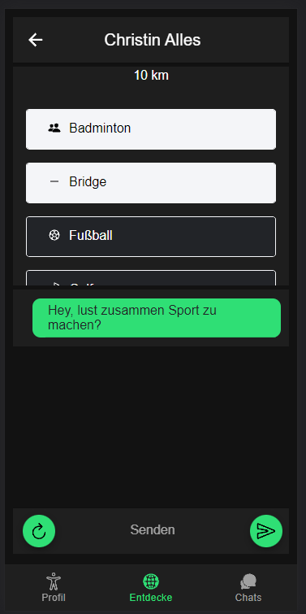
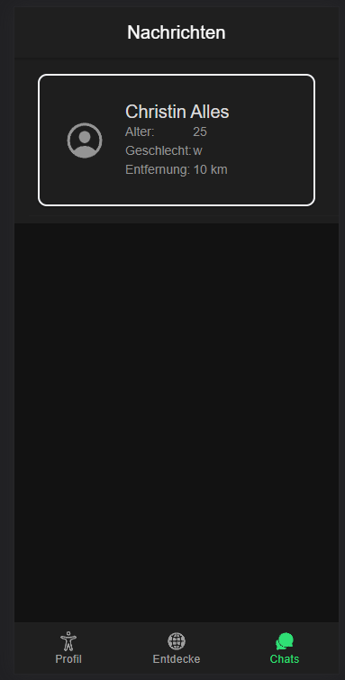

# Sport Connect

Hier eine Anleitung und Feature Liste zum benutzen der App Die App ist eine Mobile Anwendung kann im Browser geöffnet
werden Dafür bitte auf https://sport-treff.web.app/ gehen. Es sollte ein Login-screen zu sehen sein.\

## Features / Workflows

### Registrierung

wenn man vom Login auf "Sign up!" klickt öffnet sich eine Seite für die Registrierung bei einer gültigen Email (x@y.z)
und einem gültigen Passwort (zahlen und Buchstaben) sollte ein Nutzer registriert werden können bei erfolgreicher
Registration wird automatisch zum Login navigiert und eine Toast Message angezeigt\

### User loggt sich zum ersten mal ein

wenn man gültie Accountdaten im Login eingibt und auf Login klickt, dann sollte man bei einem neuen account auf der
Aktivitäten Seite Landen. Dort können Aktivitäten angeklickt werden.\
\
Wenn keine Aktivität ausgewählt ist und der Pfeil angeklickt wird taucht eine Nachricht auf\
\
Sonst wird man zum Profil geleitet\
\
\
Im Profil kann man seinen Namen, Alter und Geschlecht angeben, sowie die Aktivitäten ändern\
das drücken auf Speichern bewirkt, dass das Profil in der Cloud gespeichert wird\

### Andere Nutzer Entdecken

Im Tab "Entdecke" wird der Nutzer aufgefordert seinen Standort anzugeben\
tut er das werden die Nutzer auch auf die Entfernung gefiltert\
tut er es nicht, werden Nutzer nur nach den Aktivitäten gefiltert\
Es wird der Name, alter, Geschlecht und Entfernung der anderen Nutzer angezeigt\
\
wenn man die Aktivitäten oder die Distanz ändert, sollten Nutzer verschwinden und hinzukommen\
\
\
beim klicken auf einen Nutzer öffnet sich eine Detailansicht\

### mit Nutzer interargieren

in der Detailansicht eines Nutzers werden die Aktivitäten des nutzers angezeigt und diejenigen hervorgehoben, die
gemeinsam sind\
ein eingeloggter nutzer kann zunächst eine Willkommensnachricht schreiben, indem er auf "Hey, Lust[...]" klickt\
\
danach kann er eigene Nachrichten im Chat hinzufügen\
\
die Nachrichten können auch bei einen späteren Login wieder gesehen werden (wie beim Profil werden diese in der Cloud
gespeichert)\

### Skip Sign up

beim klicken auf Skip sign up sind alle Features gleich, nur bei dem Schreiben einer Nachricht oder beim klicken auf "
Chats" wird man zum Login navigiert

### Chats

Sobald einmal eine Nachrichten austausch zwischen zwei Nutzern besteht, taucht der Nutzer im Chat-fenster auf. Hier
werden die Nutzer nicht mehr nach Aktivitäten oder der Entfernung gefiltert. Beim klicken auf einen Nutzer ist man
ebenfalls wieder in der Detailansicht\

### Known Issues

manchmal gibt es Probleme beim Login und der Registrierung über Firebase. Sollte dies der Fall sein hilft es den Vorgang
zu wiederholen und die Email und das Passwort erneut einzutippen. Sollte keine Registrierung oder Login funktionieren,
kann ein Test-Account genutzt werden.\
Email: testuser1@gmail.com\
Passwort: test123\
\
Es kann sein, dass die Eingabefelder springen, wenn man draufklickt. Ich nehme an, dass Ionic platz für eine
Mobile-tastatur macht, aber es funktioniert nicht immer. In diesem Fall außerhalb des Eingabefeldes klicken
